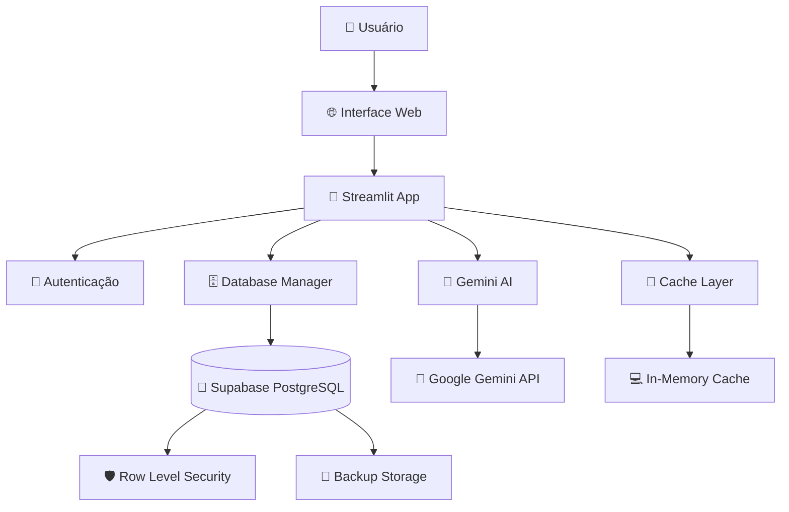
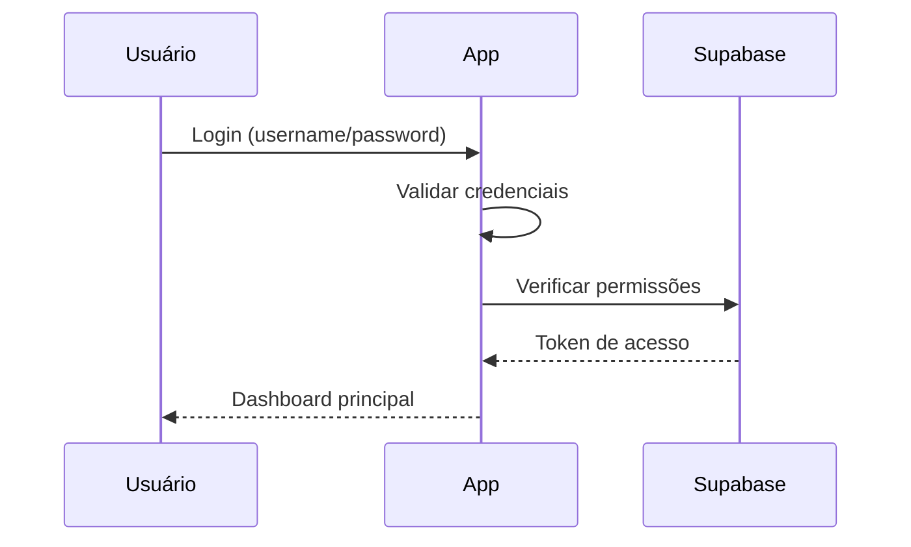
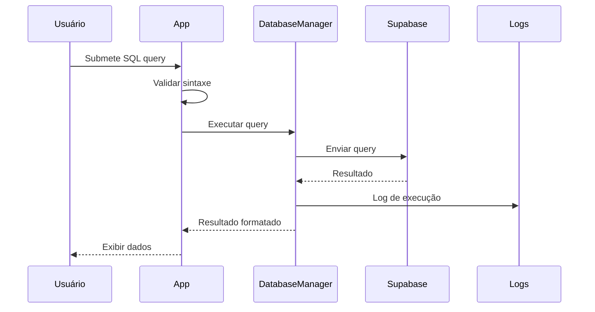
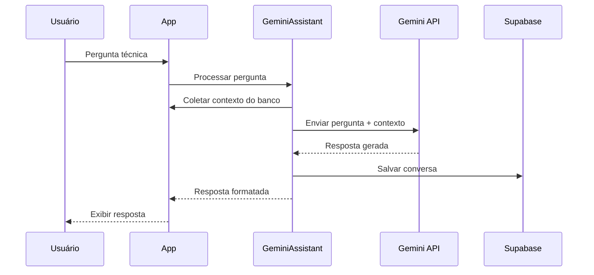
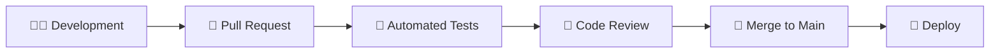

# 🏗️ Arquitetura do Sistema - PetCare DBA Admin

## 📋 Visão Geral

O PetCare DBA Admin é uma aplicação web moderna construída com arquitetura em camadas, focada em performance, segurança e escalabilidade. O sistema utiliza Python/Streamlit no frontend, Supabase como backend e Google Gemini para inteligência artificial.

## 🎯 Princípios Arquiteturais

### 1. **Separation of Concerns**
- Separação clara entre lógica de negócio, apresentação e dados
- Modularização por funcionalidade
- Baixo acoplamento entre componentes

### 2. **Scalability First**
- Arquitetura preparada para crescimento
- Cache inteligente e otimizações de performance
- Pool de conexões gerenciado

### 3. **Security by Design**
- Row Level Security (RLS) no banco
- Criptografia de dados sensíveis
- Auditoria completa de ações

### 4. **Developer Experience**
- Código autodocumentado
- Type hints completos
- Error handling robusto

---

## 🏛️ Arquitetura de Alto Nível



---

## 🔧 Componentes Principais

### 1. **Frontend Layer** 📱

#### Streamlit Application (`app.py`)
```python
# Estrutura principal da aplicação
├── Authentication System
├── Page Router
├── UI Components
├── Error Handling
└── State Management
```

**Responsabilidades:**
- Renderização da interface do usuário
- Gerenciamento de estado da sessão
- Roteamento entre páginas
- Validação de entrada
- Feedback visual para o usuário

**Tecnologias:**
- Streamlit 1.29+
- Plotly para gráficos
- Pandas para manipulação de dados
- CSS customizado para styling

### 2. **Business Logic Layer** 🧠

#### Database Manager (`DatabaseManager` class)
```python
class DatabaseManager:
    ├── Connection Management
    ├── Query Execution
    ├── Table Discovery
    ├── Metrics Collection
    └── Error Handling
```

**Responsabilidades:**
- Gerenciamento de conexões com Supabase
- Execução segura de queries SQL
- Descoberta automática de tabelas
- Coleta de métricas de performance
- Tratamento de erros de banco

#### Project Manager (`ProjectManager` class)
```python
class ProjectManager:
    ├── Project CRUD Operations
    ├── Script Management
    ├── Execution History
    ├── Version Control
    └── Collaboration Features
```

**Responsabilidades:**
- Gerenciamento de projetos SQL
- Versionamento de scripts
- Histórico de execuções
- Controle de acesso a projetos

#### Gemini Assistant (`GeminiAssistant` class)
```python
class GeminiAssistant:
    ├── AI Query Processing
    ├── Context Management
    ├── Response Generation
    ├── Conversation History
    └── Token Management
```

**Responsabilidades:**
- Integração com Google Gemini API
- Processamento de perguntas técnicas
- Manutenção de contexto das conversas
- Análise inteligente do banco de dados

### 3. **Data Layer** 🗄️

#### Supabase Integration
```sql
-- Estrutura do banco
├── projetos_analytics (Projetos)
├── scripts_projetos (Scripts SQL)
├── execucoes_scripts (Histórico)
├── duvidas_analitics_ia (Conversas IA)
└── System Tables (Métricas, Logs)
```

**Características:**
- PostgreSQL 15 com Row Level Security
- Políticas granulares de acesso
- Backup automático
- Replicação para alta disponibilidade

---

## 🔄 Fluxo de Dados

### 1. **Autenticação** 🔐


### 2. **Execução de Query** ⚡


### 3. **Consulta à IA** 🤖


---

## 🔒 Arquitetura de Segurança

### 1. **Camadas de Segurança**

```
┌─────────────────────────────────────┐
│         🌐 Transport Layer          │
│              (HTTPS/TLS)            │
├─────────────────────────────────────┤
│         🔐 Application Layer        │
│          (Authentication)           │
├─────────────────────────────────────┤
│          🛡️ Business Layer          │
│         (Authorization)             │
├─────────────────────────────────────┤
│           🗄️ Data Layer             │
│        (Row Level Security)         │
└─────────────────────────────────────┘
```

### 2. **Row Level Security (RLS)**
```sql
-- Exemplo de política RLS
CREATE POLICY "users_own_projects" ON projetos_analytics
    FOR ALL TO authenticated
    USING (created_by = auth.email() OR auth.email() = ANY(membros));
```

### 3. **Auditoria e Logs**
- Todas as ações são logadas
- Rastreamento de mudanças nos dados
- Alertas de segurança automáticos
- Backup de logs em storage seguro

---

## ⚡ Arquitetura de Performance

### 1. **Cache Strategy**
```python
# Multi-layer caching
├── Session Cache (st.session_state)
├── Function Cache (@st.cache_data)
├── Database Cache (Query results)
└── CDN Cache (Static assets)
```

### 2. **Database Optimization**
- Índices automáticos em colunas frequentemente consultadas
- Connection pooling inteligente
- Query optimization automática
- Particionamento de tabelas grandes

### 3. **Frontend Performance**
- Lazy loading de componentes pesados
- Pagination automática para grandes datasets
- Compression de assets estáticos
- Minimal re-renders com state management

---

## 🔧 Padrões de Design

### 1. **Repository Pattern**
```python
class DatabaseRepository:
    def get_tables(self) -> List[Table]
    def execute_query(self, sql: str) -> QueryResult
    def get_metrics(self) -> Metrics
```

### 2. **Factory Pattern**
```python
class ConnectionFactory:
    @staticmethod
    def create_connection(config: DatabaseConfig) -> Connection
```

### 3. **Observer Pattern**
```python
class MetricsObserver:
    def update(self, metrics: Metrics) -> None
```

### 4. **Strategy Pattern**
```python
class QueryExecutionStrategy:
    def execute(self, query: Query) -> Result
```

---

## 📊 Monitoramento e Observabilidade

### 1. **Métricas de Sistema**
```python
metrics = {
    'performance': {
        'response_time': 'ms',
        'throughput': 'queries/sec',
        'error_rate': '%'
    },
    'resources': {
        'cpu_usage': '%',
        'memory_usage': 'MB',
        'disk_usage': '%'
    },
    'business': {
        'active_users': 'count',
        'queries_executed': 'count',
        'projects_created': 'count'
    }
}
```

### 2. **Health Checks**
- Database connectivity
- API endpoints availability
- AI service status
- Cache layer health

### 3. **Alerting**
- Performance degradation
- Error rate spikes
- Security violations
- Resource exhaustion

---

## 🚀 Deployment Architecture

### 1. **Single Instance** (Atual)
```
┌─────────────────────────────────────┐
│            🖥️ Server               │
│  ┌─────────────────────────────┐    │
│  │      Streamlit App          │    │
│  │                             │    │
│  │  ┌─────────┐ ┌─────────┐   │    │
│  │  │  App    │ │ Config  │   │    │
│  │  └─────────┘ └─────────┘   │    │
│  └─────────────────────────────┘    │
└─────────────────────────────────────┘
              │
              ▼
    ┌─────────────────────┐
    │    🐘 Supabase      │
    │   (PostgreSQL)      │
    └─────────────────────┘
```

### 2. **Multi-Instance** (Futuro)
```
    ┌─────────────┐
    │ Load Balancer│
    └─────────────┘
           │
    ┌──────┴──────┐
    ▼             ▼
┌─────────┐  ┌─────────┐
│Instance1│  │Instance2│
└─────────┘  └─────────┘
    │             │
    └──────┬──────┘
           ▼
    ┌─────────────┐
    │  Database   │
    │   Cluster   │
    └─────────────┘
```

---

## 🔄 CI/CD Pipeline

### 1. **Development Flow**


### 2. **Quality Gates**
- Unit tests (>80% coverage)
- Integration tests
- Security scanning
- Performance testing
- Code quality checks

---

## 📚 Documentação da API

### 1. **Internal APIs**
```python
# Database Manager API
class DatabaseManager:
    def get_tables() -> List[Dict]
    def execute_query(sql: str) -> Dict
    def get_metrics() -> Dict
    def backup_table(table_name: str) -> Dict
```

### 2. **External Integrations**
```python
# Supabase API
- REST API para CRUD operations
- Real-time subscriptions
- Authentication & authorization
- Storage API para arquivos

# Gemini API
- Text generation
- Code analysis
- Context-aware responses
```

---

## 🔮 Roadmap Arquitetural

### Fase 1: Otimização (Q3 2025)
- Implementação de cache Redis
- Otimização de queries complexas
- Performance monitoring avançado

### Fase 2: Escalabilidade (Q4 2025)
- Multi-tenant architecture
- Horizontal scaling
- Database sharding

### Fase 3: Microserviços (Q1 2026)
- Separação em microserviços
- API Gateway
- Service mesh

---

## 📖 Referências Técnicas

### Documentação
- [Streamlit Docs](https://docs.streamlit.io/)
- [Supabase Docs](https://supabase.com/docs)
- [Google AI Docs](https://ai.google.dev/)

### Padrões e Práticas
- Clean Architecture (Robert Martin)
- Domain-Driven Design (Eric Evans)
- Microservices Patterns (Chris Richardson)

---

*Última atualização: 29 de Junho de 2025*
*Arquiteto: Equipe PetCare AI*
